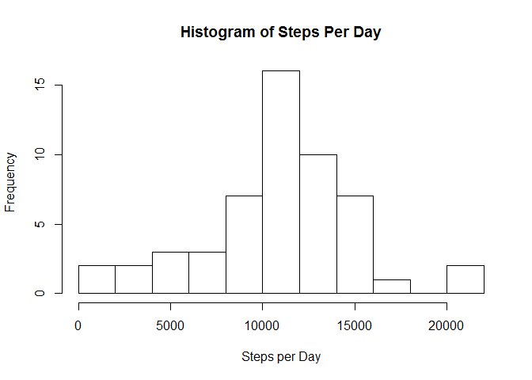
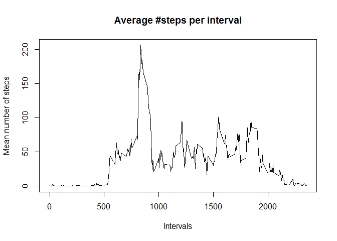
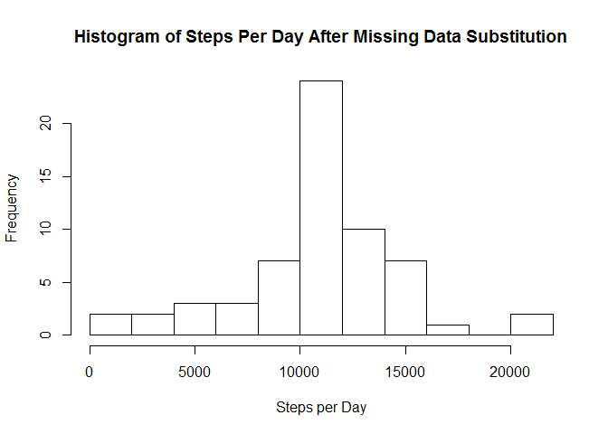
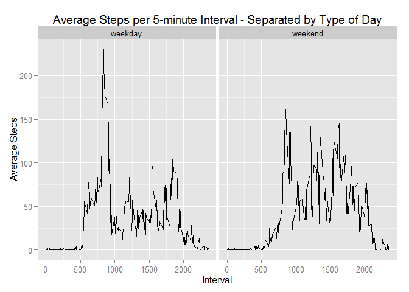

# Reproducible Research: Peer Assessment 1
+ Author: Jeff Heatwole
+ Date: May 17, 2015


## Required Libraries

```r
require(dplyr)
require(ggplot2)
```

## Loading and preprocessing the data
A personal monitoring device collects data at 5 minute intervals through out the day. This device has collected two months of data from an anonymous
individual collected during the months of October and November, 2012
and included the number of steps taken in 5 minute intervals each day.


```r
fname <- 'activity.csv'
```

The data has been stored in a .csv file (activity.csv) that must be in the same working directory as this markdown file.


```r
## Open and read the raw data file. Make a working copy.
if (!file.exists(fname)) {
    stop(paste("Could not open '", fname, "'. Please check working folder."))        
}
rawdata <- read.csv(fname)
workingData <- rawdata
```

## What is mean total number of steps taken per day?

This operation is fairly simple.  Using the `tapply` function, we will sum up total steps taken on each day, and then use the `hist` function from the basic plotting system to produce a histogram showing 12 breaks.


```r
dailySums <- tapply(workingData$steps, workingData$date, FUN=sum)
hist(dailySums, breaks=12, main="Histogram of Steps Per Day", xlab="Steps per Day", ylab="Frequency")
```

 

With the code snippet below, standard R functions can determine the `mean` and `median` number of steps per day.


```r
meanDay <- mean(dailySums,  na.rm=TRUE)
meanFormat <- format(meanDay, big.mark=",") 
medianDay <- median(dailySums, na.rm=TRUE)
medianFormat <- format(medianDay, big.mark=",") 
```

+ Mean steps per day = 10,766.19
+ Median steps per day = 10,765

## What is the average daily activity pattern?

Data was reported in 5-minute intervals throughout the 24-hour day, yielding a total of 288 intervals of data per day.  In order to plot an average day, an average number of steps must be found for each interval throughout the study period.  This is accomplished with the following R code.


```r
  intervalMeans <- tapply(workingData$steps, workingData$interval, mean, na.rm=TRUE)
  uniqueInterval <- unique(workingData$interval)
  intervalMeans <- cbind(uniqueInterval, intervalMeans)
```
The `tapply` function does the hard work in finding the mean number of steps in each interval throughout the study period.  The other two statements are used to bind the interval identifiers to the means data in preparation for producing a plot.

The basic `plot` is produced below, with type = 'l' allowing R to connect the individual points with line segments.


```r
plot(intervalMeans, type="l", main = "Average #steps per interval", xlab="Intervals", ylab = "Mean number of steps")
```

 

## Imputing missing values

At this point in the analysis, an astute reader may have noticed that many of the functions were run with 'na.rm = TRUE'.  This means that R has ignored missing values and computed means and medians from the data that was collected.  What if the missing values were imputed, i.e., what if we replaced each NA data observation with the mean #steps observed for that interval across the entire data set?  We can accomplish this as follows:


```r
# create a table of missing steps data
missing <- is.na(workingData$steps)
table(missing)
intervalMeans <- as.data.frame(intervalMeans)
colnames(intervalMeans)[1] <- "interval"
```


```r
# Essentialy a "join" operation, merge the interval means data into the working data set
dataReplace <- merge(x=workingData, y=intervalMeans, by="interval", all.x=TRUE)
# step through data fram and replace all NA values for steps with means for that interval
for (i in 1:nrow(dataReplace)) if (is.na(dataReplace[i,2])) dataReplace[i,2] <- dataReplace[i,4]
```

Now that the missing values have been imputed, create new structures to determine changes in mean and median, if any.


```r
adjDailySums <- tapply(dataReplace$steps, dataReplace$date, FUN=sum)
adjMeanDay <- mean(adjDailySums, na.rm=TRUE)
adjMedianDay <- median(adjDailySums, na.rm=TRUE)
```
Now we are ready to take a look at the same plots as above, except with missing values imputed.  This is what the new histogram looks like after missing data has been replaced with interval means.


```r
hist(adjDailySums, breaks=12, main="Histogram of Steps Per Day After Missing Data Substitution", xlab="Steps per Day", ylab="Frequency")
```

 

The observation is that the graph seems to have the same shape as the one produced with raw data, except that there is a much bigger spike in the 10,000 - 12,000 steps bucket.

The new statistics can now be calulated.


```r
adjMeanDay <- mean(adjDailySums,  na.rm=TRUE)
adjMeanFormat <- format(adjMeanDay, big.mark=",") 
adjMedianDay <- median(adjDailySums, na.rm=TRUE)
adjMedianFormat <- format(adjMedianDay, big.mark=",") 
```
+ Mean steps per day = 10,766.19
+ Median steps per day = 10,766.19

Hold on a second.  It appears that the overall daily median moved slightly, but the overall daily mean did not change at all when interval means were substituted for missing data.  How can this be?


As it turns out, when the missing data is scrutinized, we find that exactly 8 complete days of data were missing (and none of the days had partial data).  Thus, when we replace the missing data, we are replacing 8 full days with interval means.  It is fairly simple to show a mathematical proof of why the mean doesn't change (and the author of this paper would be happy to do so if he knew how to produce nice mathematical formulas using knitr).


Another curious result is that the median has moved to be exactly equal to the mean.  At first, this result seems strange, but when one realizes that eight complete days have replaced with the exact same data, and that the steps per day data seems to be normally distributed (as evidenced by the histogram of the raw data), is it any surprise that the new median is one of the days containing entirely data composed of interval means?  Thus, the results do make sense.


## Are there differences in activity patterns between weekdays and weekends?

In order to tackle this final question, a `factor variable` must be introduced into the analysis.  This is possible through use of the `weekdays()` function, which will return a string indicating Day of the Week for any data.


```r
dataFinal <- dataReplace

# create a Date object that can be used for subsequent analysis
dataFinal$Date <- strptime(dataFinal[,3], "%Y-%m-%d")

# determine day of week for each row (observation)
dataFinal$wkdy = weekdays(dataFinal$Date, abbreviate = TRUE)

# now we no longer need the Date field
dataFinal$Date <- NULL
```

Now that we have determined the day of week for each observation in the data set, use R functions to group by a weekday/weekend factor and summarize the means for each group.


```r
# create a factor based on day-of-week to characterize each observation as weekday or weekend
dataFinal$factorWkdy = as.factor(ifelse(dataFinal$wkdy %in% c('Sat', 'Sun'), "weekend", "weekday"))

# use dplyr group_by function to separate data based on new factor
finalGroup <- group_by(dataFinal, interval, factorWkdy)

# determine summary data for weekdays and weekends
finalSummary <- summarise(finalGroup, steps=mean(steps))
```

Finally, produce a plot that allows a direct comparison of mean steps per interval on 
weekdays and weekends.


```r
g <- ggplot(finalSummary, aes(interval, steps))
g + geom_line() + facet_grid(. ~ factorWkdy) + ggtitle("Average Steps per 5-minute Interval - Separated by Type of Day") +  xlab("Interval") + ylab("Average Steps")
```

 

While the weekday graph shows a higher level of activity during the 8:00 a.m. hour, the weekend graph shows a higher level of activity throughout the remainder of the day.
